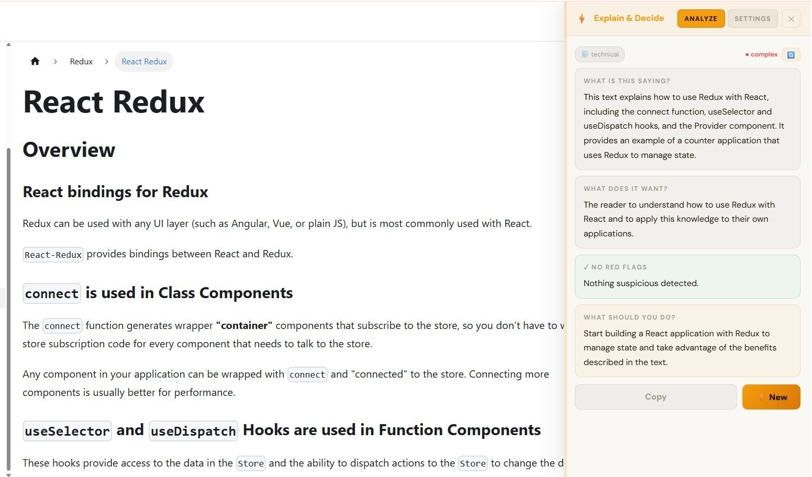
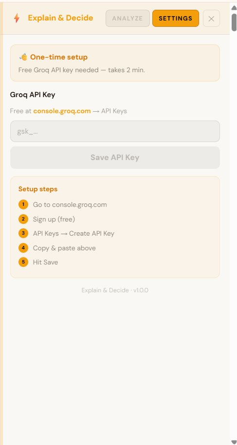
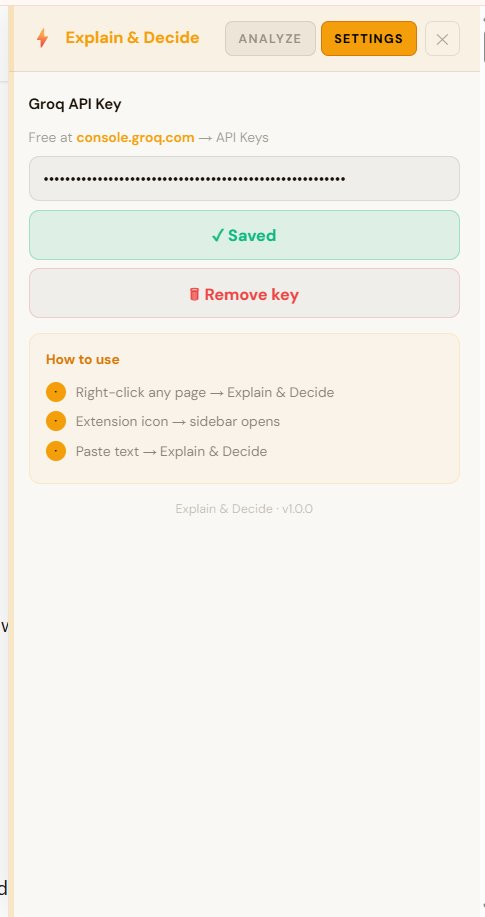

# ⚡ Explain & Decide

A Chrome Extension that instantly explains confusing text on any webpage - contracts, emails, notices, terms & conditions - right in a sidebar. No tab switching, no copy-pasting, no back-and-forth.

---

## The Problem

You're reading something online and you don't fully understand it. The old flow:

> Copy → Open ChatGPT → Paste → Wait → Decipher → Back and forth → Finally decide

**That's 10 steps for something that should take 1.**

---

## The Solution

Click the extension icon - a sidebar slides in. Paste any text or analyze the current page and get a structured breakdown instantly:

| | |
|---|---|
| 🔍 **What is this saying?** | Plain English summary |
| ⚡ **What does it want?** | What action it expects from you |
| 🚩 **Watch out** | Red flags, hidden clauses, suspicious claims |
| 👉 **What should you do?** | One clear next step |

---

## Features

- **Persistent sidebar** - slides in from the right, stays open while you browse
- **Resizable** - drag the left edge to adjust width (300px–600px)
- **Analyze tab** - paste any text and get an instant breakdown
- **Explain this page** - smart content detection (article → main → body)
- **Right-click menu** - select text on any page → right-click → Explain & Decide
- **Copy summary** - one click to copy the full breakdown
- **Settings tab** - guided API key setup with step-by-step onboarding
- **Invalid key detection** - auto-redirects to settings with clear error message
- **Cream theme** - easy on the eyes, doesn't clash with page content

---

## Tech Stack

- **React 18 + TypeScript** - sidebar UI
- **Vite** - dual build (ES module for popup/background, IIFE for content script)
- **Chrome Manifest V3** - service worker, content scripts, context menus, scripting API
- **Groq API** - llama-3.3-70b-versatile (free tier, fast inference)
- **chrome.storage.sync** - secure API key storage

---

## Architecture

```
Extension icon click
        ↓
Popup fires TOGGLE_SIDEBAR → background.js forwards to active tab
        ↓
content.tsx (content script) - mounts React sidebar on page
        ↓
User pastes text / clicks "Explain this page"
        ↓
SidebarApp → CALL_GROQ message → background.js (service worker)
        ↓
Groq API → llama-3.3-70b-versatile
        ↓
Structured JSON → 4 result cards
```

---

## Screenshots

### In action - analyzing a page


### First-time setup


### Settings - API key saved


## Getting Started

### 1. Clone the repo

```bash
git clone https://github.com/your-username/explain-and-decide.git
cd explain-and-decide
```

### 2. Install dependencies

```bash
npm install
```

### 3. Build

```bash
npm run build
```

This runs two Vite builds:
- Main build (popup + background) - ES module format
- Content build - IIFE format (required for Chrome content scripts)

### 4. Load in Chrome

1. Open `chrome://extensions`
2. Enable **Developer Mode** (top right toggle)
3. Click **Load unpacked**
4. Select the `dist/` folder

### 5. Add your Groq API key

1. Click the extension icon - sidebar opens
2. Go to **Settings** tab
3. Get a free key at [console.groq.com](https://console.groq.com) → API Keys → Create
4. Paste and save - you're ready

---

## Project Structure

```
src/
├── background/
│   └── background.ts         # Service worker - Groq API proxy, context menus
├── content/
│   ├── content.tsx           # Mounts React sidebar, bridges chrome messages
│   └── content.css           # Host container styles
├── sidebar/
│   ├── SidebarApp.tsx        # Root - state, message handling, layout
│   ├── AnalyzeTab.tsx        # Idle / loading / error views
│   ├── ResultView.tsx        # Result cards + copy/new actions
│   ├── SettingsTab.tsx       # API key setup + onboarding
│   ├── types.ts              # Shared types + style constants
│   └── sidebar.tsx           # React entry point
├── App.tsx                   # Popup - fires sidebar toggle
├── theme.ts                  # Category icons + complexity colors
└── types.ts                  # Shared TypeScript interfaces
```

---

## Built By

**Shraddha Gaikwad** - Frontend Engineer  
[LinkedIn](https://www.linkedin.com/in/shraddha-3010/)
